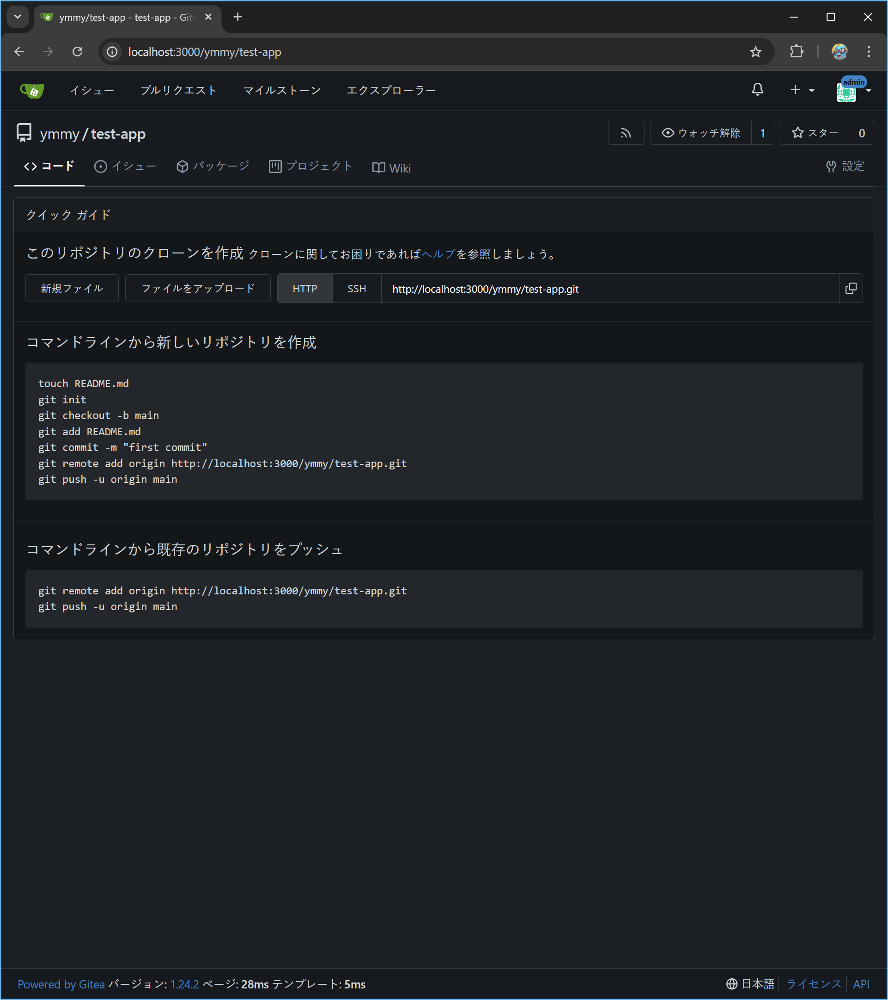

# giteaを使ってPC上にリモートリポジトリを構築する

## 概要
Giteaを使って、ローカル環境にリモートリポジトリを構築する手順のメモ。

## 実施環境
- Windows 11
- Docker Compose

## 手順
### 1. コンテナ起動
```bash
docker compose up -d
```

### 2. Giteaの初期設定
ブラウザで http://localhost:3000 にアクセスし、Giteaの初期設定を行う

> [!important]
> 「<span style="color:red; font-weight:bold;">*</span>」は初期値との変更点

- データベースのタイプ
  ```
  SQLite3
  ```
- ホスト <span style="color:red; font-weight:bold;">*</span>
  ```
  /data/gitea.db
  ```
- サイトタイトル <span style="color:red; font-weight:bold;">*</span>
  ```
  ymmy gitea
  ```
- リポジトリのルートパス <span style="color:red; font-weight:bold;">*</span>
  ```
  /data/git/repositories
  ```
- Git LFSルートパス <span style="color:red; font-weight:bold;">*</span>
  ```
  /data/git/lfs
  ```
- 実行ユーザー名
  ```
  git
  ```
- サーバードメイン
  ```
  localhost
  ```
- SSHサーバーのポート
  ```
  2222
  ```
- Gitea HTTPポート
  ```
  3000
  ```
- GiteaのベースURL
  ```
  http://localhost:3000/
  ```
- ログの保存先パス <span style="color:red; font-weight:bold;">*</span>
  ```
  /data/log
  ```
- 管理者アカウントの設定 <span style="color:red; font-weight:bold;">*</span>
  - 管理者ユーザー名 <span style="color:red; font-weight:bold;">*</span>
    ```
    ymmy
    ```
  - メールアドレス <span style="color:red; font-weight:bold;">*</span>
    ```
    ymmy@example.com
    ```
  - パスワード <span style="color:red; font-weight:bold;">*</span>
    ```
    ymmy
    ```
  - パスワードの確認 <span style="color:red; font-weight:bold;">*</span>
    ```
    ymmy
    ```


### 3. リポジトリの作成
### 3.1. Giteaのトップページに移動し、右上の「**+**」ボタンをクリックして「新しいリポジトリ」を選択


### 3.2. リポジトリの情報を入力
リポジトリ名、公開／非公開設定くらい。

> [!note]
> 空のリモートリポジトリを作成する場合は、デフォルトブランチは空欄にしておく。



### 4. ローカルリポジトリの設定
```bash
git remote add origin <リモートリポジトリのURL>
```

### 5. 3000ポートの開放
別端末からGiteaにアクセスするために、3000ポートを開放する必要がある。

```bash
New-NetFirewallRule -DisplayName "Gitea HTTP 3000" -Direction Inbound -Protocol TCP -LocalPort 3000 -Action Allow -Profile Private
```

> [!note]
> このコマンドはWindows PowerShell（管理者）で実行する

#### 成功例
```bash
Name                          : {0c316cb8-6db0-4f19-b5ce-f9ce075dc29a}
DisplayName                   : Gitea HTTP 3000
Description                   :
DisplayGroup                  :
Group                         :
Enabled                       : True
Profile                       : Private
Platform                      : {}
Direction                     : Inbound
Action                        : Allow
EdgeTraversalPolicy           : Block
LooseSourceMapping            : False
LocalOnlyMapping              : False
Owner                         :
PrimaryStatus                 : OK
Status                        : 規則は、ストアから正常に解析されました。 (65536)
EnforcementStatus             : NotApplicable
PolicyStoreSource             : PersistentStore
PolicyStoreSourceType         : Local
RemoteDynamicKeywordAddresses : {}
PolicyAppId                   :
PackageFamilyName             :
```

---

> [!tip]
> ここからは、別端末からリモートリポジトリにアクセスする手順。

> [!warning]
> 同じネットワーク上にいないとアクセスはできない！

> [!note]
> 事前にサーバーIPアドレスを確認しておく。\
> 例）Windows PowerShellで以下のコマンドを実行する。
> ```bash
> ipconfig
> ```
> 「IPv4 アドレス」の値

### 6. アカウント作成

http://<サーバーIPアドレス>:3000/user/sign_up
にアクセスしてアカウントを作成する。


### 7. 共同作業者の登録
> [!note]
> リポジトリの所有者が、共同作業者を登録する

リポジトリのトップページに移動し、右上の「設定」→「共同作業者」を選択。


### 8. アクセスできるか確認

リポジトリ（例：http://<サーバーIPアドレス>:3000/ymmy/test-app）にアクセスして、Giteaのトップページが表示されることを確認する。

